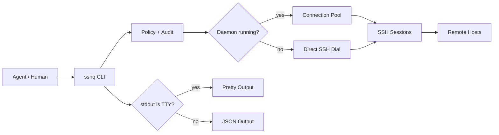

<div align="center">

# sshq

Agent-safe SSH in one cross-platform binary.

[](https://go.dev)
[](LICENSE)
[]()

[English](README.md) | [中文](README.zh-CN.md)

</div>

Let an AI agent run `ssh` against a remote host and two problems show up fast:

1. Anything interactive stalls the call. An unknown host key or a password prompt has no one to answer it, so the agent just waits until the timeout kills it.
2. Even when the command works, what comes back is a mess: login banners, progress-bar redraws, encoding accidents. Hundreds of junk lines land straight in the agent's context, and extracting the answer means guessing with regexes.

sshq exists to give agents a decent ssh experience:

1. Agents can't answer prompts, so anything that would prompt fails immediately with a structured error and the exact command that fixes it.
2. When an agent calls sshq, stdout is a JSON envelope it can parse directly, no guessing; remote command output is never mixed with sshq's own messages.
3. On first connect sshq detects the remote shell and caches the result, with stale-shell detection and config hot-reload. Every later command is wrapped in that shell's syntax, and output is transcoded to UTF-8 on the way back.

```bash
# Human in a terminal: stdout is a TTY, so sshq prints text.
sshq web-1 "hostname"
# web-1

# Agent or script: stdout is a pipe, so sshq prints a JSON envelope.
# jq here only pretty-prints; any pipe or redirect triggers JSON, jq is not the switch.
sshq web-1 "hostname" | jq .
# {
#   "exit_code": 0,
#   "data": {
#     "stdout": "web-1\n",
#     "stderr": "",
#     "alias": "web-1",
#     "duration_ms": 42
#   }
# }
```

## Quick start

### Install

No Go toolchain, no sudo. The stable download URLs always resolve to the latest release:

```bash
mkdir -p ~/.local/bin

# Linux amd64
curl -L https://github.com/shayuc137/sshq/releases/latest/download/sshq_linux_amd64.tar.gz | tar xz -C ~/.local/bin

# macOS (Apple Silicon)
curl -L https://github.com/shayuc137/sshq/releases/latest/download/sshq_darwin_arm64.tar.gz | tar xz -C ~/.local/bin

# macOS (Intel)
curl -L https://github.com/shayuc137/sshq/releases/latest/download/sshq_darwin_amd64.tar.gz | tar xz -C ~/.local/bin
```

If the shell can't find sshq afterwards, add `~/.local/bin` to PATH (most Linux distributions already have it; macOS needs it added).

Windows: download [`sshq_windows_amd64.zip`](https://github.com/shayuc137/sshq/releases/latest/download/sshq_windows_amd64.zip), extract it, and put `sshq.exe` somewhere on PATH.

If you have Go 1.26+: `go install github.com/shayuc137/sshq/cmd/sshq@latest`

Later, `sshq update` upgrades the binary and every installed agent skill in one step.

### Run your first command

sshq reads your existing `~/.ssh/config` and `~/.ssh/known_hosts` directly. Any host you can already `ssh` into works the moment sshq is installed, nothing to migrate:

```bash
sshq ls                  # list every host already in your config
sshq myhost "uname -a"   # just run it
```

To add a new host, one command writes it into `~/.ssh/config` (atomically, with a backup):

```bash
sshq config add myhost \
  --hostname 10.0.0.1 \
  --user root \
  --identity ~/.ssh/id_ed25519

sshq trust myhost        # fetch and pin the host key
sshq myhost "uname -a"
```

`trust` writes the host key to `known_hosts` once. If the key ever changes, sshq refuses the connection until you verify and run `sshq trust myhost --replace`. For password-only devices, `sshq credential set myhost` stores the password encrypted instead of leaving it in a config file.

The shortcut form `sshq myhost "cmd"` is the same execution path as `sshq exec myhost "cmd"`. Use `exec` when you need its flags:

```bash
sshq exec myhost --script-file ./scripts/health-check.sh
sshq exec win-1 --shell powershell "Get-ComputerInfo | Select-Object CsName,WindowsVersion"
sshq --timeout 10s myhost "hostname"
```

### Transfer, fan out, tunnel

```bash
sshq cp ./deploy.tar.gz myhost:/tmp/
sshq cp myhost:/var/log/app.log ./logs/
sshq cp web-1:/data/export.tar.gz backup-1:/srv/backups/   # server to server, streamed

sshq cluster exec "systemctl is-active nginx" --tag web --env production --concurrency 5

sshq tunnel start bastion -L 15432:db.internal:5432
sshq tunnel list
sshq tunnel stop tun-1
```

When something misbehaves, `sshq doctor myhost` runs seven ordered checks and returns the first failure with a command you can paste to fix it.

## What sshq does differently

| Behavior | Why it matters |
| --- | --- |
| TTY auto-detection | Agents get JSON without passing `--json`; humans get readable terminal output without passing `--pretty`. |
| Fail fast, never prompt | Unknown host keys, missing auth, and policy blocks return structured errors with a ready-to-run fix instead of hanging on an interactive prompt. |
| stdout purity for `exec` | stdout is exactly the remote stdout. sshq's own status, progress, and diagnostics go to stderr. |
| Daemon connection pool | Repeat calls reuse SSH sessions. If the daemon is unavailable, commands fall back to direct SSH. |
| SFTP with raw fallback | File transfer works on normal servers and on minimal BusyBox/OpenWrt-style hosts without `sftp-server`. |
| Remote shell detection | sshq probes bash, ash, zsh, sh, PowerShell, and cmd, then wraps commands with the right syntax. PowerShell scripts run through `-EncodedCommand` for reliable multi-line and CJK support. |
| Server-to-server relay | `sshq cp hostA:/path hostB:/path` streams through the local sshq process without writing a local temp file. |
| Capability policy | Command allow/deny lists, path allowlists, tunnel allowlists, temporary grants, and audit logging in one policy layer. |
| AI skill install | `sshq skill install` teaches Claude Code or Codex to route SSH work through sshq. |

## Output contract

Output mode priority: `--json` > `--pretty` > `SSHQ_OUTPUT=json` env var > TTY detection.

One hard rule for `exec`: stdout only carries remote command output. Everything else goes to stderr.

```bash
# Remote stdout stays clean.
sshq myhost "printf 'one\ntwo\n'"
# one
# two

# sshq diagnostics stay on stderr.
sshq -v myhost "hostname" >/tmp/remote.out 2>/tmp/sshq.log
```

The JSON envelope has exactly two shapes, and the shape alone tells you what happened:

```bash
# Shape one: sshq did its job, data holds the result.
# The remote command's exit code sits at the top level; non-zero means the remote command failed.
sshq myhost "ls /nonexistent" | jq .
# {
#   "exit_code": 2,
#   "data": {
#     "stdout": "",
#     "stderr": "ls: cannot access '/nonexistent': No such file or directory\n",
#     "alias": "myhost",
#     "duration_ms": 215
#   }
# }

# Shape two: sshq itself failed, error holds the reason.
# code is for machines, hint is for humans, action can be run as-is.
sshq exec badhost "uname"
# {
#   "error": {
#     "code": "host_not_found",
#     "hint": "host \"badhost\" not found",
#     "action": "run 'sshq ls' to see available hosts"
#   }
# }
```

The two shapes are safety information for agents: an `error` means the command never reached the remote host, so fix it per `action` and retry (the one exception is `error.code` of `result_indeterminate`, meaning the command may have run and you should verify remote state first); `data` with a non-zero `exit_code` means the command already ran remotely, so think about side effects before retrying.

The process exit code tells the same story: `0` = done and the answer is good; `1` = done but the answer is bad news (remote command failed, probe unreachable, doctor found problems); `2` = sshq itself failed and the envelope carries `error`. A shell script reading `$?` and an agent reading the envelope always reach the same conclusion.

## Security model

Two trust questions matter for a tool like this: can you trust sshq itself, and can you hand it to an agent.

### Trust and privacy

Fair question for a tool that holds the keys to your servers: what does sshq do with them?

Nothing leaves your machine. There is no telemetry. The only HTTP client in the codebase belongs to `sshq update`, runs only when you invoke it, and refuses redirects away from GitHub. Authentication goes through your running ssh-agent when there is one; key files named in `~/.ssh/config` are read locally to sign the SSH handshake, and that is all they are used for.

The daemon listens on a Unix socket with `0600` permissions inside your user config directory. It opens no TCP port, and `--no-daemon` skips it entirely. Your `~/.ssh/config` is read as-is and written only on an explicit `sshq config add/update/remove`, atomically, with a backup left next to it. Everything sshq owns (passwords, policy, audit logs) lives in a separate `config.toml`. Uninstalling means deleting the binary and that config directory.

sshq is pre-1.0. Breaking changes to the JSON envelope ship with a version bump and are called out prominently in the [CHANGELOG](CHANGELOG.md).

### Handing it to an agent

Passwords go in an encrypted store, never in config files. `sshq credential set myhost` prompts once and encrypts with age; auth order is ssh-agent, then key file, then stored password. No command prints a stored password back.

The capability policy limits what an agent can actually do, per host or globally:

```toml
[policy.default]
command_blacklist = ["(?i)(^|[;&|])\\s*(rm|dd|mkfs|shutdown)\\b"]

[policy.hosts.prod-db]
mode = "override"
command_whitelist = ["^journalctl(\\s|$)", "^systemctl\\s+status\\s"]
remote_path_whitelist = ["/var/log"]
```

Both the CLI and daemon paths enforce it. `sshq policy check prod-db --command "..."` tests a decision without running anything, and `sshq policy grant` issues terminal-only temporary permissions that expire by TTL and never override a blacklist.

The audit log records every `exec`, `cp`, `tunnel`, `cluster`, and policy-blocked operation as JSONL metadata. Command output, passwords, and script contents stay out of it; scripts are logged as a SHA-256 hash and byte count. If audit is enabled but the log cannot be written, sshq refuses to run the operation rather than proceed unrecorded.

Full reference with all policy fields and grant kinds: [Security guide](docs/en/guide/security.md).

## Architecture



The daemon manages pooled connections, cached shell profiles, and background tunnels. Everything works without it too, just slower on repeat calls.

## Agent integration

Claude Code, Codex, Cursor, or any tool that runs subprocesses can call sshq directly; the pipe detection shown at the top of this page is all it takes. The bundled skill goes further and teaches the agent to route all SSH work through sshq instead of raw `ssh` and `scp`:

```bash
sshq skill install                       # Claude Code, user scope
sshq skill install --codex               # Codex
sshq skill install --project             # project-level install
sshq skill status
```

## Documentation

| Resource | Use it when you need to... |
| --- | --- |
| [Getting Started](docs/en/guide/getting-started.md) | install sshq, add a host, trust its key, run the first command |
| [Remote Execution](docs/en/guide/remote-execution.md) | run commands, script files, shell overrides, timeouts, Windows encoding |
| [File Transfer](docs/en/guide/file-transfer.md) | upload, download, recursive copy, remote-to-remote relay, engine fallback |
| [Cluster Operations](docs/en/guide/cluster-operations.md) | run one command across selected hosts with controlled concurrency |
| [Tunnels](docs/en/guide/tunnels.md) | create local or remote port forwards and manage daemon-owned tunnels |
| [Host Management](docs/en/guide/host-management.md) | edit SSH config, metadata, ProxyJump chains, credentials, trust keys |
| [Security](docs/en/guide/security.md) | configure credential encryption, capability policy, temporary grants, audit logs |
| [Agent Integration](docs/en/guide/agent-integration.md) | understand JSON envelopes, stdout purity, error handling, and skill usage |
| [Skill package](skills/sshq/SKILL.md) | see the routing table agents use |

## Contributing

See [CONTRIBUTING.md](CONTRIBUTING.md) for setup, workflow, tests, documentation sync, and commit message rules.

## License

[MIT](LICENSE)
