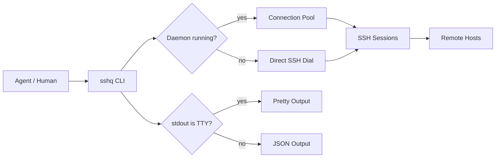

<div align="center">

# sshq

**Agent-native SSH multiplexing CLI.**

Single binary. Cross-platform. Zero-config structured output for AI agents.

[](https://go.dev)
[](LICENSE)
[]()

[English](README.md) | [中文](README.zh-CN.md)

</div>

---

## What is this?

sshq is an SSH CLI built for AI agents. When an agent calls sshq through a subprocess, it automatically gets structured JSON output — no `--json` flag needed. When a human runs it in a terminal, it shows pretty-formatted tables. This is decided by [TTY detection](docs/guide/agent-integration.md), not flags.

Under the hood: a daemon connection pool reuses SSH sessions across calls, SFTP falls back to raw byte streams on minimal hosts, and remote shell type is auto-detected (bash, ash, powershell, cmd) so commands are wrapped correctly without the caller knowing.

## Quick Start

**Install:**

```bash
go install github.com/shayuc137/sshq/cmd/sshq@latest
```

Or download a prebuilt binary from [GitHub Releases](https://github.com/shayuc137/sshq/releases).

**Add a host:**

```bash
sshq config add myhost --hostname 10.0.0.1 --user root --identity ~/.ssh/id_ed25519
```

**Run a command:**

```bash
sshq myhost "uname -a"
```

**Transfer a file:**

```bash
sshq cp ./deploy.tar.gz myhost:/tmp/
```

**Run across multiple hosts:**

```bash
sshq cluster exec --tag web "systemctl status nginx"
```

## Core Capabilities

| Capability | What it does |
|-----------|-------------|
| **TTY auto-detect** | pipe → JSON, terminal → pretty. Agents get structured data with zero flags. |
| **Connection pool** | Daemon reuses SSH sessions. Starts automatically, degrades transparently. |
| **Shell detection** | Probes remote shell (bash/ash/powershell/cmd), wraps commands correctly. |
| **Transfer engine** | SFTP first, raw byte stream fallback. Handles hosts without sftp-server. |
| **Server relay** | `sshq cp host-a:/data host-b:/backup` — direct relay, no local temp file. |
| **ProxyJump chains** | Multi-hop bastion traversal from SSH config. Just use the target alias. |
| **Cluster exec** | Concurrent execution across hosts filtered by tag, env, or explicit list. |
| **SSH tunnels** | Local and remote port forwarding with automatic reconnect. |

## Architecture



## Agent Integration

sshq is designed as a tool for AI agents (Claude Code, Cursor, Codex, etc.). The key design principle: **agents don't need special flags**.

```bash
# Agent calls via subprocess — stdout is a pipe, so output is automatically JSON:
result=$(sshq myhost "df -h")
# → {"ok":true,"data":{"exit_code":0,"stdout":"...","stderr":"","host":"myhost","duration_ms":42},"schema_version":1}

# Human types in terminal — stdout is TTY, so output is pretty:
sshq myhost "df -h"
# → Filesystem      Size  Used Avail Use% Mounted on
#   /dev/sda1        50G   12G   35G  26% /
```

**Install as a Claude Code skill:**

```bash
claude skill add --from github.com/shayuc137/sshq/skills/sshq
```

See [Agent Integration Guide](docs/guide/agent-integration.md) for details on output contracts, error handling, and the stdout purity guarantee.

## Output Modes

| Mode | When | Override |
|------|------|---------|
| **JSON** | stdout is pipe (agent) | `--json` forces JSON in terminal |
| **Pretty** | stdout is terminal (human) | `--pretty` forces pretty in pipe |

All sshq informational messages (connection status, progress, timing) go to stderr. The exec command's stdout is always an exact mirror of the remote command's stdout — no pollution, in any mode.

Environment variable: `SSHQ_OUTPUT=json` forces JSON globally.

## Documentation

| Resource | Description |
|----------|-------------|
| [Getting Started](docs/guide/getting-started.md) | Install, configure your first host, run your first command |
| [Remote Execution](docs/guide/remote-execution.md) | exec, script-file, shell override, timeout, encoding |
| [File Transfer](docs/guide/file-transfer.md) | Upload, download, relay, recursive, engine fallback |
| [Cluster Operations](docs/guide/cluster-operations.md) | Multi-host exec, tag/env/hosts filtering |
| [Tunnels](docs/guide/tunnels.md) | Local/remote forwarding, multi-tunnel management |
| [Host Management](docs/guide/host-management.md) | Config CRUD, metadata, ProxyJump, trust |
| [Agent Integration](docs/guide/agent-integration.md) | TTY detection, JSON contracts, stdout purity, skill install |
| [Command Reference](docs/commands/reference.md) | All commands, flags, and defaults |

## Project Structure

```
sshq/
├── cmd/sshq/              # Entry point
├── internal/
│   ├── cli/               # Cobra command definitions
│   ├── config/            # SSH config parser + metadata
│   ├── exec/              # Remote command execution
│   ├── output/            # Output layer (TTY detect, JSON/pretty)
│   ├── pool/              # Connection pool (daemon)
│   ├── remote/            # Shell detection, encoding, profile cache
│   ├── sshclient/         # SSH dial + ProxyJump + host key
│   ├── transfer/          # SFTP + raw stream file transfer
│   └── tunnel/            # SSH tunnel management
├── skills/sshq/           # Claude Code skill package
└── docs/                  # Guides and command reference
```

## Contributing

Contributions are welcome. See [CONTRIBUTING.md](CONTRIBUTING.md) for development setup and guidelines.

<a href="https://github.com/shayuc137/sshq/graphs/contributors">
  
</a>

## License

[MIT](LICENSE)
