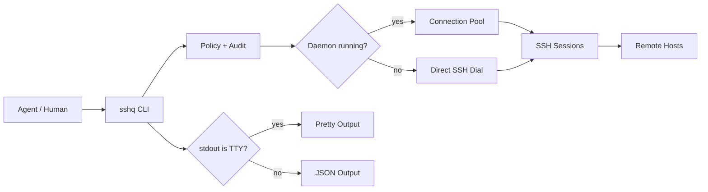

<div align="center">

# sshq

Agent-safe SSH in one cross-platform binary.

[](https://go.dev)
[](LICENSE)
[]()

[English](README.md) | [中文](README.zh-CN.md)

</div>

AI agents call SSH through subprocesses. What comes back is unstructured text, mixed with connection banners, progress bars, and encoding surprises. The agent parses it with regex and hopes for the best.

sshq cleans up the plumbing. Pipe calls get JSON automatically. Terminal sessions get readable text. Remote stdout is never polluted by sshq's own messages. Shell differences between bash, ash, PowerShell, and cmd are sorted out before the caller sees anything.

```bash
# Human in a terminal: stdout is a TTY, so sshq prints text.
sshq web-1 "hostname"
# web-1

# Agent or script: stdout is a pipe, so sshq prints a JSON envelope.
sshq web-1 "hostname" | jq .
# {
#   "ok": true,
#   "data": {
#     "exit_code": 0,
#     "stdout": "web-1\n",
#     "stderr": "",
#     "host": "web-1",
#     "duration_ms": 42
#   },
#   "schema_version": 1
# }
```

## Quick start

### Install

No Go or other toolchain required. Pick your platform:

```bash
# Linux amd64
curl -L https://github.com/shayuc137/sshq/releases/latest/download/sshq_linux_amd64.tar.gz | tar xz
sudo mv sshq /usr/local/bin/

# macOS (Apple Silicon)
curl -L https://github.com/shayuc137/sshq/releases/latest/download/sshq_darwin_arm64.tar.gz | tar xz
sudo mv sshq /usr/local/bin/

# macOS (Intel)
curl -L https://github.com/shayuc137/sshq/releases/latest/download/sshq_darwin_amd64.tar.gz | tar xz
sudo mv sshq /usr/local/bin/
```

Windows: download `sshq_windows_amd64.zip` from [Releases](https://github.com/shayuc137/sshq/releases), extract, and put `sshq.exe` somewhere on PATH.

If you have Go 1.23+: `go install github.com/shayuc137/sshq/cmd/sshq@latest`

```bash
sshq version
```

See the [Getting Started guide](docs/en/guide/getting-started.md) for detailed platform instructions.

### Add a host

```bash
sshq config add myhost \
  --hostname 10.0.0.1 \
  --user root \
  --identity ~/.ssh/id_ed25519
```

For a password-only device, keep the password out of `~/.ssh/config` and store it in the encrypted credential store:

```bash
sshq credential set myhost
```

### Trust the host key

```bash
sshq trust myhost
sshq probe myhost
```

`trust` writes the host key to `known_hosts`. If a key changes later, sshq refuses to overwrite it unless you run `sshq trust myhost --replace` after verifying the change.

### Run a command

```bash
sshq myhost "uname -a"
```

The shortcut above is the same execution path as:

```bash
sshq exec myhost "uname -a"
```

Use `exec` when you need command-specific flags:

```bash
sshq exec --script-file ./scripts/health-check.sh myhost
sshq exec --shell powershell win-1 "Get-ComputerInfo | Select-Object CsName,WindowsVersion"
sshq --timeout 10s myhost "hostname"
```

### Transfer, fan out, tunnel

```bash
sshq cp ./deploy.tar.gz myhost:/tmp/
sshq cp myhost:/var/log/app.log ./logs/
sshq cp web-1:/data/export.tar.gz backup-1:/srv/backups/

sshq cluster exec "systemctl is-active nginx" --tag web --env production --concurrency 5

sshq tunnel start bastion -L 15432:db.internal:5432
sshq tunnel list
sshq tunnel stop tun-1
```

## What sshq does differently

| Behavior | Why it matters |
| --- | --- |
| TTY auto-detection | Agents get JSON without passing `--json`; humans get readable terminal output without passing `--pretty`. |
| stdout purity for `exec` | stdout is exactly the remote stdout. sshq's own status, progress, and diagnostics go to stderr. |
| Daemon connection pool | Repeat calls reuse SSH sessions. If the daemon is unavailable, commands fall back to direct SSH. |
| SFTP with raw fallback | File transfer works on normal servers and on minimal BusyBox/OpenWrt-style hosts without `sftp-server`. |
| Remote shell detection | sshq probes bash, ash, zsh, sh, PowerShell, and cmd paths, then wraps commands with the right syntax. |
| Server-to-server relay | `sshq cp hostA:/path hostB:/path` streams through the local sshq process without writing a local temp file. |
| Capability policy | Command allow/deny lists, file path allowlists, tunnel forward allowlists, temporary grants, and audit logging live in one policy layer. |
| AI skill install | `sshq skill install` installs routing instructions for Claude Code or Codex. |

## Output contract

Output mode priority: `--json` > `--pretty` > `SSHQ_OUTPUT=json` env var > TTY detection.

One hard rule for `exec`: stdout only carries remote command output. Everything else goes to stderr.

```bash
# Remote stdout stays clean.
sshq myhost "printf 'one\ntwo\n'"
# one
# two

# sshq diagnostics stay on stderr.
sshq -v myhost "hostname" >/tmp/remote.out 2>/tmp/sshq.log
```

In JSON mode, remote output lands in `data.stdout`:

```json
{
  "ok": true,
  "data": {
    "exit_code": 0,
    "stdout": "one\ntwo\n",
    "stderr": "",
    "host": "myhost",
    "duration_ms": 42
  },
  "schema_version": 1
}
```

A successful SSH connection does not mean the remote command succeeded — check both `ok` and `data.exit_code`.

## Security model

Passwords, access rules, and audit logs live in `config.toml`, separate from `~/.ssh/config`.

### Encrypted credentials

```bash
sshq credential set router-1
sshq credential list
sshq credential delete router-1
```

Passwords are encrypted with age. Auth priority: ssh-agent > key file > stored password. No command prints stored passwords.

Headless environments (daemon, agent pipe): set `SSHQ_CREDENTIAL_PASSPHRASE` before starting sshq.

### Capability policy

Policy lives in `config.toml` under the OS config directory, such as `~/.config/sshq/config.toml` on Linux.

```toml
[policy.default]
command_whitelist = ["^hostname(\\s|$)", "^uptime(\\s|$)", "^df(\\s|$)"]
command_blacklist = ["(?i)(^|[;&|])\\s*(rm|dd|mkfs|shutdown)\\b"]
local_path_whitelist = ["."]
remote_path_whitelist = ["/tmp", "/var/log"]
local_forward_whitelist = ["localhost:*", "127.0.0.1:*", "db.internal:5432"]
remote_forward_whitelist = ["localhost:3000", "127.0.0.1:8000-9000"]

[policy.hosts.prod-db]
mode = "override"
command_whitelist = ["^journalctl(\\s|$)", "^systemctl\\s+status\\s"]
command_blacklist = ["(?i)\\b(reboot|shutdown|mkfs)\\b"]
remote_path_whitelist = ["/var/log"]
local_forward_whitelist = ["db.internal:5432"]
```

Both CLI and daemon paths run policy checks. For tunnels, `-L` checks the remote target, `-R` checks the local target.

Test a decision before running the operation:

```bash
sshq policy validate
sshq policy check prod-db --command "journalctl -u app -n 100"
sshq policy check prod-db --remote-path /var/log/app.log
sshq policy check prod-db --local-forward db.internal:5432
```

Temporary grants require a terminal, expire by TTL, and never override blacklists:

```bash
sshq policy grant prod-db "^journalctl(\\s|$)" --ttl 15m
sshq policy grant prod-db db.internal:5432 --kind local-forward --ttl 15m
sshq policy revoke --alias prod-db
```

### Audit log

```toml
[audit]
enabled = true
path = "~/.config/sshq/audit.jsonl"
max_size = "10MB"
```

Records every `exec`, `cp`, `tunnel`, `cluster`, and policy-blocked operation as JSONL metadata. No command output, passwords, or script contents are stored (scripts get a SHA-256 hash and byte count).

```bash
sshq audit --last 50
sshq audit --alias prod-db --operation exec
```

If audit is on but the log can't be written, sshq refuses to run the operation. No silent bypass.

## Architecture



The daemon manages pooled connections, cached profiles, and background tunnels. Everything works without it too — just slower on repeat calls.

## Agent integration

Claude Code, Codex, Cursor, or any tool that can run a subprocess can call sshq directly.

```bash
# Agent calls via subprocess: stdout is a pipe, so output is JSON.
result=$(sshq myhost "df -h")
# → {"ok":true,"data":{"exit_code":0,"stdout":"...","stderr":"","host":"myhost","duration_ms":42},"schema_version":1}

# Human types in a terminal: stdout is a TTY, so output is readable.
sshq myhost "df -h"
# → Filesystem      Size  Used Avail Use% Mounted on
#   /dev/sda1        50G   12G   35G  26% /
```

Install the bundled skill:

```bash
sshq skill install                       # Claude Code, user scope
sshq skill install --codex               # Codex
sshq skill install --project             # project-level install
sshq skill status
```

The skill makes agents route SSH work through sshq, load command references on demand, and stop using raw `ssh` / `scp`.

## Documentation

| Resource | Use it when you need to... |
| --- | --- |
| [Getting Started](docs/en/guide/getting-started.md) | install sshq, add a host, trust its key, run the first command |
| [Remote Execution](docs/en/guide/remote-execution.md) | run commands, script files, shell overrides, timeouts, Windows encoding |
| [File Transfer](docs/en/guide/file-transfer.md) | upload, download, recursive copy, remote-to-remote relay, engine fallback |
| [Cluster Operations](docs/en/guide/cluster-operations.md) | run one command across selected hosts with controlled concurrency |
| [Tunnels](docs/en/guide/tunnels.md) | create local or remote port forwards and manage daemon-owned tunnels |
| [Host Management](docs/en/guide/host-management.md) | edit SSH config, metadata, ProxyJump chains, credentials, trust keys |
| [Security](docs/en/guide/security.md) | configure credential encryption, capability policy, temporary grants, audit logs |
| [Agent Integration](docs/en/guide/agent-integration.md) | understand JSON envelopes, stdout purity, error handling, and skill usage |
| [Skill package](skills/sshq/SKILL.md) | see the routing table agents use |
| [Skill references](skills/sshq/references/) | inspect scenario-specific command references |

## Project structure

```text
sshq/
├── cmd/sshq/              # entry point
├── internal/
│   ├── audit/             # JSONL operation audit log
│   ├── cli/               # Cobra command definitions
│   ├── config/            # SSH config parser + sshq metadata
│   ├── credential/        # encrypted password store
│   ├── exec/              # remote command execution
│   ├── output/            # TTY detection, JSON/pretty rendering
│   ├── policy/            # capability policy, grants, forward/path checks
│   ├── pool/              # connection pool daemon
│   ├── remote/            # shell detection, encoding, profile cache
│   ├── sshclient/         # SSH dial, ProxyJump, host key handling
│   ├── transfer/          # SFTP + raw stream file transfer
│   └── tunnel/            # SSH tunnel management
├── skills/sshq/           # AI skill package
└── docs/                  # guides and command references
```

## Contributing

See [CONTRIBUTING.md](CONTRIBUTING.md) for setup, workflow, tests, documentation sync, and commit message rules.

## License

[MIT](LICENSE)
