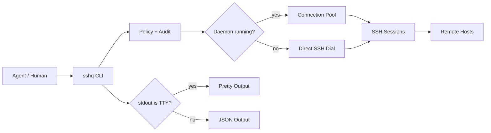

<div align="center">

# sshq

跨平台 SSH 单二进制，为 AI agent 设计。

[](https://go.dev)
[](LICENSE)
[]()

[English](README.md) | [中文](README.zh-CN.md)

</div>

agent 调 SSH 最头疼的事：拿回来的是一堆文本，混着连接提示、进度条、各种编码问题，得靠正则猜着 parse。

sshq 解决的就是这个。通过管道调用时自动输出 JSON，在终端里用时自动输出易读格式。远程命令的 stdout 就是远端的 stdout，sshq 自己的信息全走 stderr，不会混进去。远端是 bash 还是 PowerShell，sshq 替你处理好。

```bash
# 人在终端里执行：stdout 是 TTY，所以输出文本。
sshq web-1 "hostname"
# web-1

# Agent 或脚本调用：stdout 是管道，所以输出 JSON 信封。
sshq web-1 "hostname" | jq .
# {
#   "ok": true,
#   "exit_code": 0,
#   "data": {
#     "exit_code": 0,
#     "stdout": "web-1\n",
#     "stderr": "",
#     "host": "web-1",
#     "duration_ms": 42
#   },
#   "schema_version": 2
# }
```

## 快速开始

### 安装

不需要安装 Go 或其他工具链，选择你的平台：

```bash
# Linux amd64
curl -L https://github.com/shayuc137/sshq/releases/latest/download/sshq_linux_amd64.tar.gz | tar xz
sudo mv sshq /usr/local/bin/

# macOS (Apple Silicon)
curl -L https://github.com/shayuc137/sshq/releases/latest/download/sshq_darwin_arm64.tar.gz | tar xz
sudo mv sshq /usr/local/bin/

# macOS (Intel)
curl -L https://github.com/shayuc137/sshq/releases/latest/download/sshq_darwin_amd64.tar.gz | tar xz
sudo mv sshq /usr/local/bin/
```

Windows：从 [Releases](https://github.com/shayuc137/sshq/releases) 下载 `sshq_windows_amd64.zip`，解压后把 `sshq.exe` 放到 PATH 中的文件夹。

有 Go 1.23+ 的话：`go install github.com/shayuc137/sshq/cmd/sshq@latest`

```bash
sshq version
```

详细的各平台安装步骤见[快速开始指南](docs/zh-CN/guide/getting-started.md)。

### 添加主机

```bash
sshq config add myhost \
  --hostname 10.0.0.1 \
  --user root \
  --identity ~/.ssh/id_ed25519
```

遇到只能用密码登录的设备时，不要把密码写进 `~/.ssh/config`，用加密凭据库保存：

```bash
sshq credential set myhost
```

### 信任主机密钥

```bash
sshq trust myhost
sshq probe myhost
```

`trust` 会把主机密钥写入 `known_hosts`。如果以后密钥变化，sshq 会拒绝覆盖；确认变更可信后再运行 `sshq trust myhost --replace`。

### 执行命令

```bash
sshq myhost "uname -a"
```

上面的快捷写法和下面的显式写法走同一条执行路径：

```bash
sshq exec myhost "uname -a"
```

需要命令专属参数时使用 `exec`：

```bash
sshq exec --script-file ./scripts/health-check.sh myhost
sshq exec --shell powershell win-1 "Get-ComputerInfo | Select-Object CsName,WindowsVersion"
sshq --timeout 10s myhost "hostname"
```

### 传输、批量执行、隧道

```bash
sshq cp ./deploy.tar.gz myhost:/tmp/
sshq cp myhost:/var/log/app.log ./logs/
sshq cp web-1:/data/export.tar.gz backup-1:/srv/backups/

sshq cluster exec "systemctl is-active nginx" --tag web --env production --concurrency 5

sshq tunnel start bastion -L 15432:db.internal:5432
sshq tunnel list
sshq tunnel stop tun-1
```

## 有什么不同

| 特性 | 说明 |
| --- | --- |
| TTY 自动检测 | 管道调用自动 JSON，终端自动易读格式，不用加任何 flag |
| stdout 干净 | `exec` 的 stdout 就是远端 stdout，sshq 自己的信息全走 stderr |
| 连接池 | daemon 后台复用 SSH 会话，没有 daemon 时自动直连，不影响使用 |
| 传输降级 | 有 SFTP 就用 SFTP，没有（比如 OpenWrt）就走原始字节流 |
| shell 适配 | 自动探测远端 bash/ash/PowerShell/cmd，用对应语法包装命令。PowerShell 脚本走 `-EncodedCommand` 执行，多行和中文稳定可靠 |
| 一步诊断 | `sshq doctor <alias>` 按顺序跑七项检查（从配置到 shell 探测），返回第一个失败点和可直接执行的 `next_action` |
| 服务器中转 | `sshq cp hostA:/path hostB:/path` 直接流式中转，不落本地 |
| 安全策略 | 命令黑白名单、路径白名单、隧道转发白名单、临时授权、审计日志 |
| skill 安装 | `sshq skill install` 一键安装到 Claude Code 或 Codex |

## 输出规则

sshq 按以下优先级决定输出格式：`--json` > `--pretty` > 环境变量 `SSHQ_OUTPUT=json` > TTY 检测。

`exec` 有一条硬规则：stdout 只放远端命令的输出，sshq 自己的东西全走 stderr。

```bash
# 远端 stdout 保持干净。
sshq myhost "printf 'one\ntwo\n'"
# one
# two

# sshq 诊断信息写入 stderr。
sshq -v myhost "hostname" >/tmp/remote.out 2>/tmp/sshq.log
```

JSON 模式下，同样的保证体现在 `data.stdout`：

```json
{
  "ok": true,
  "exit_code": 0,
  "data": {
    "exit_code": 0,
    "stdout": "one\ntwo\n",
    "stderr": "",
    "host": "myhost",
    "duration_ms": 42
  },
  "schema_version": 2
}
```

`ok: true` 表示 sshq 调用本身完成了，远端命令的执行结果要看顶层 `exit_code`——非零值表示远端进程失败，即使 `ok` 为 `true`。

## 安全模型

密码、权限策略、审计日志都独立于 `~/.ssh/config`，统一放在 `config.toml` 里管理。

### 加密凭据

```bash
sshq credential set router-1
sshq credential list
sshq credential delete router-1
```

密码用 age 加密存储。认证优先级：ssh-agent > 私钥 > 存储的密码。没有命令会打印密码明文。

无终端环境（daemon、agent 管道）下需要凭据库时，启动前设好 `SSHQ_CREDENTIAL_PASSPHRASE` 环境变量。

### 能力策略

策略写在系统配置目录下的 `config.toml`，Linux 上通常是 `~/.config/sshq/config.toml`。

```toml
[policy.default]
command_whitelist = ["^hostname(\\s|$)", "^uptime(\\s|$)", "^df(\\s|$)"]
command_blacklist = ["(?i)(^|[;&|])\\s*(rm|dd|mkfs|shutdown)\\b"]
local_path_whitelist = ["."]
remote_path_whitelist = ["/tmp", "/var/log"]
local_forward_whitelist = ["localhost:*", "127.0.0.1:*", "db.internal:5432"]
remote_forward_whitelist = ["localhost:3000", "127.0.0.1:8000-9000"]

[policy.hosts.prod-db]
mode = "override"
command_whitelist = ["^journalctl(\\s|$)", "^systemctl\\s+status\\s"]
command_blacklist = ["(?i)\\b(reboot|shutdown|mkfs)\\b"]
remote_path_whitelist = ["/var/log"]
local_forward_whitelist = ["db.internal:5432"]
```

CLI 直连和 daemon 路径都走策略检查。隧道方面，`-L` 检查远端目标，`-R` 检查本地目标。

执行前可以先试一下会不会被拦：

```bash
sshq policy validate
sshq policy check prod-db --command "journalctl -u app -n 100"
sshq policy check prod-db --remote-path /var/log/app.log
sshq policy check prod-db --local-forward db.internal:5432
```

临时授权需要终端交互，到期自动失效，黑名单永远不能绕过：

```bash
sshq policy grant prod-db "^journalctl(\\s|$)" --ttl 15m
sshq policy grant prod-db db.internal:5432 --kind local-forward --ttl 15m
sshq policy revoke --alias prod-db
```

### 审计日志

```toml
[audit]
enabled = true
path = "~/.config/sshq/audit.jsonl"
max_size = "10MB"
```

记录每次 `exec`、`cp`、`tunnel`、`cluster` 操作和被策略拦截的请求。只记元数据，不存命令输出、密码或脚本内容（脚本只记 SHA-256 和字节数）。

```bash
sshq audit --last 50
sshq audit --alias prod-db --operation exec
```

审计开了但日志写不进去时，sshq 会拒绝执行，不会静默跳过。

## 架构



daemon 管连接池、profile 缓存和后台隧道。没有 daemon 也能用，只是每次重新连。

## Agent 集成

Claude Code、Codex、Cursor 这类工具可以直接通过子进程调用 sshq。

```bash
# Agent 通过子进程调用：stdout 是管道，所以输出 JSON。
result=$(sshq myhost "df -h")
# → {"ok":true,"exit_code":0,"data":{"exit_code":0,"stdout":"...","stderr":"","host":"myhost","duration_ms":42},"schema_version":2}

# 人在终端里输入：stdout 是 TTY，所以输出易读文本。
sshq myhost "df -h"
# → Filesystem      Size  Used Avail Use% Mounted on
#   /dev/sda1        50G   12G   35G  26% /
```

`ok: true` 表示 sshq 调用完成。远端命令的结果在顶层 `exit_code` 里——非零值意味着远端进程失败，即便 `ok` 为 `true`。

安装内置 skill：

```bash
sshq skill install                       # Claude Code，用户级
sshq skill install --codex               # Codex
sshq skill install --project             # 项目级安装
sshq skill status
```

skill 让 agent 的 SSH 操作都走 sshq，按场景加载命令参考，不再直接调 `ssh` / `scp`。

## 文档

| 资源 | 适用场景 |
| --- | --- |
| [快速开始](docs/zh-CN/guide/getting-started.md) | 安装 sshq、添加主机、信任密钥、运行第一条命令 |
| [远程执行](docs/zh-CN/guide/remote-execution.md) | 命令执行、脚本文件、shell 覆盖、超时、Windows 编码 |
| [文件传输](docs/zh-CN/guide/file-transfer.md) | 上传、下载、递归复制、远端到远端中转、传输引擎回退 |
| [集群操作](docs/zh-CN/guide/cluster-operations.md) | 对筛选出的多台主机执行同一条命令并控制并发 |
| [SSH 隧道](docs/zh-CN/guide/tunnels.md) | 创建本地/远端端口转发，管理 daemon 持有的隧道 |
| [主机管理](docs/zh-CN/guide/host-management.md) | 编辑 SSH config、元数据、ProxyJump 链、凭据、主机密钥 |
| [安全](docs/zh-CN/guide/security.md) | 配置凭据加密、能力策略、临时授权、审计日志 |
| [Agent 集成](docs/zh-CN/guide/agent-integration.md) | 理解 JSON 信封、stdout 纯净性、错误处理和 skill 用法 |
| [Skill 包](skills/sshq/SKILL.md) | 查看 agent 使用的路由表 |
| [Skill 参考](skills/sshq/references/) | 查看按场景拆分的命令参考 |

## 项目结构

```text
sshq/
├── cmd/sshq/              # 入口
├── internal/
│   ├── audit/             # JSONL 操作审计日志
│   ├── cli/               # Cobra 命令定义
│   ├── config/            # SSH 配置解析 + sshq 元数据
│   ├── credential/        # 加密密码凭据库
│   ├── exec/              # 远程命令执行
│   ├── output/            # TTY 检测，JSON/易读渲染
│   ├── policy/            # 能力策略、临时授权、转发/路径检查
│   ├── pool/              # 连接池 daemon
│   ├── remote/            # shell 探测、编码、profile 缓存
│   ├── sshclient/         # SSH 连接、ProxyJump、主机密钥处理
│   ├── transfer/          # SFTP + 原始字节流文件传输
│   └── tunnel/            # SSH 隧道管理
├── skills/sshq/           # AI skill 包
└── docs/                  # 指南和命令参考
```

## 参与贡献

见 [CONTRIBUTING.md](CONTRIBUTING.md)。

## 许可证

[MIT](LICENSE)
