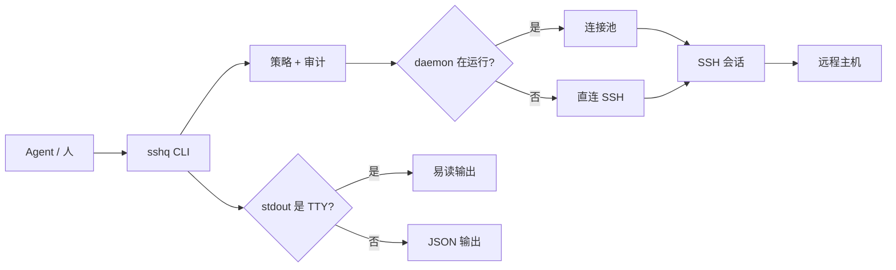

<div align="center">

# sshq

跨平台 SSH 单二进制，为 AI agent 设计。

[](https://go.dev)
[](LICENSE)
[]()

[English](README.md) | [中文](README.zh-CN.md)

</div>

让 agent 在子进程里跑 `ssh`，会坏在两个地方。一是各种提示会把调用挂死：碰上未知 host key 或者密码询问，就那么干等到超时。二是就算跑通了，拿回来的也是一锅粥，连接横幅、进度条、编码乱码全混在一起，agent 只能靠正则猜着解析。

sshq 把这些管道问题都处理掉了。所有会触发交互提示的场景一律立即失败，返回结构化错误和一条能直接执行的修复命令。stdout 接管道时自动输出 JSON 信封，接终端时自动输出易读文本。远程命令的输出永远和 sshq 自己的信息分开。远端是 bash 还是 PowerShell，在调用方看到结果之前就已经处理好了。

```bash
# 人在终端里执行：stdout 是 TTY，所以输出文本。
sshq web-1 "hostname"
# web-1

# Agent 或脚本调用：stdout 是管道，所以输出 JSON 信封。
sshq web-1 "hostname" | jq .
# {
#   "ok": true,
#   "exit_code": 0,
#   "data": {
#     "exit_code": 0,
#     "stdout": "web-1\n",
#     "stderr": "",
#     "host": "web-1",
#     "duration_ms": 42
#   },
#   "schema_version": 2
# }
```

## 快速开始

### 安装

不需要 Go 或其他工具链。稳定下载地址始终指向最新版本：

```bash
# Linux amd64
curl -L https://github.com/shayuc137/sshq/releases/latest/download/sshq_linux_amd64.tar.gz | tar xz
sudo mv sshq /usr/local/bin/

# macOS (Apple Silicon)
curl -L https://github.com/shayuc137/sshq/releases/latest/download/sshq_darwin_arm64.tar.gz | tar xz
sudo mv sshq /usr/local/bin/

# macOS (Intel)
curl -L https://github.com/shayuc137/sshq/releases/latest/download/sshq_darwin_amd64.tar.gz | tar xz
sudo mv sshq /usr/local/bin/
```

Windows：下载 [`sshq_windows_amd64.zip`](https://github.com/shayuc137/sshq/releases/latest/download/sshq_windows_amd64.zip)，解压后把 `sshq.exe` 放进 PATH 里的目录。

有 Go 1.26+ 的话：`go install github.com/shayuc137/sshq/cmd/sshq@latest`

之后升级只需要 `sshq update`，二进制和已安装的 agent skill 一步到位。

### 添加主机，跑第一条命令

```bash
sshq config add myhost \
  --hostname 10.0.0.1 \
  --user root \
  --identity ~/.ssh/id_ed25519

sshq trust myhost        # 获取并固定 host key
sshq myhost "uname -a"   # 跑点什么
```

`trust` 把 host key 写进 `known_hosts`，只写一次。之后 key 一旦变化，sshq 会拒绝连接，直到你核实后执行 `sshq trust myhost --replace`。只有密码的设备用 `sshq credential set myhost`，密码加密存储，配置文件里不留明文。

快捷形式 `sshq myhost "cmd"` 和 `sshq exec myhost "cmd"` 走同一条执行路径。需要命令级 flag 时用 `exec`：

```bash
sshq exec --script-file ./scripts/health-check.sh myhost
sshq exec --shell powershell win-1 "Get-ComputerInfo | Select-Object CsName,WindowsVersion"
sshq --timeout 10s myhost "hostname"
```

### 传文件、批量跑、开隧道

```bash
sshq cp ./deploy.tar.gz myhost:/tmp/
sshq cp myhost:/var/log/app.log ./logs/
sshq cp web-1:/data/export.tar.gz backup-1:/srv/backups/   # 服务器到服务器，流式中转

sshq cluster exec "systemctl is-active nginx" --tag web --env production --concurrency 5

sshq tunnel start bastion -L 15432:db.internal:5432
sshq tunnel list
sshq tunnel stop tun-1
```

哪里不对劲就跑 `sshq doctor myhost`：按顺序做七项检查，返回第一个失败点和一条能直接粘贴执行的修复命令。

## 有什么不同

| 特性 | 说明 |
| --- | --- |
| TTY 自动检测 | 管道调用自动 JSON，终端自动易读格式，不用加任何 flag |
| 立即失败，绝不提示 | 未知 host key、认证缺失、策略拦截都立即返回结构化错误和修复命令，绝不弹交互提示把 agent 挂住 |
| stdout 干净 | `exec` 的 stdout 就是远端 stdout，sshq 自己的信息全走 stderr |
| 连接池 | daemon 后台复用 SSH 会话，没有 daemon 时自动直连，不影响使用 |
| 传输降级 | 有 SFTP 就用 SFTP，没有（比如 OpenWrt）就走原始字节流 |
| shell 适配 | 自动探测远端 bash/ash/PowerShell/cmd，用对应语法包装命令。PowerShell 脚本走 `-EncodedCommand` 执行，多行和中文稳定可靠 |
| 服务器中转 | `sshq cp hostA:/path hostB:/path` 直接流式中转，不落本地 |
| 安全策略 | 命令黑白名单、路径白名单、隧道转发白名单、临时授权、审计日志 |
| skill 安装 | `sshq skill install` 让 Claude Code 或 Codex 把 SSH 操作全部路由到 sshq |

## 输出规则

输出格式按优先级决定：`--json` > `--pretty` > 环境变量 `SSHQ_OUTPUT=json` > TTY 检测。

`exec` 有一条硬规则：stdout 只承载远程命令的输出，其他一切走 stderr。

```bash
# 远端 stdout 保持干净。
sshq myhost "printf 'one\ntwo\n'"
# one
# two

# sshq 的诊断信息全在 stderr。
sshq -v myhost "hostname" >/tmp/remote.out 2>/tmp/sshq.log
```

JSON 模式下，`ok: true` 只代表 sshq 这次调用本身成功。远程命令的结果看顶层 `exit_code`，它非零就说明远端进程失败了，哪怕 `ok` 是 `true`。两个都要看。

## 安全模型

这类工具有两个信任问题：sshq 本身可不可信，以及敢不敢把它交给 agent。

### 信任与隐私

一个握着你所有服务器钥匙的工具，它自己拿这些钥匙做了什么？这个问题值得问。

什么都不会离开你的机器。没有遥测。整个代码库唯一的 HTTP 客户端属于 `sshq update`，只在你主动执行时运行，重定向到 GitHub 以外的任何地方都会被拒绝。认证优先用你正在运行的 ssh-agent；`~/.ssh/config` 里引用的密钥文件只在本地读取、用于握手签名，用途仅此而已。

daemon 监听的是用户配置目录下权限 `0600` 的 Unix socket，不开任何 TCP 端口，加 `--no-daemon` 可以完全绕过它。你的 `~/.ssh/config` 会被原样读取，只在你显式执行 `sshq config add/update/remove` 时才原子写入，旁边留一份备份。sshq 自己的东西（密码、策略、审计日志）都放在独立的 `config.toml` 里。卸载就是删掉二进制和这个配置目录，别的地方不会留下任何东西。

sshq 还在 1.0 之前。JSON 信封带 `schema_version` 字段，破坏性的输出变更会递增版本号并记录在 [CHANGELOG](CHANGELOG.md)。

### 交给 agent

密码进加密存储，不进配置文件。`sshq credential set myhost` 问一次密码，用 age 加密；认证顺序是 ssh-agent、密钥文件、存储的密码。没有任何命令会把存储的密码打印出来。

能力策略限制 agent 实际能做什么，可以按主机配，也可以全局配：

```toml
[policy.default]
command_blacklist = ["(?i)(^|[;&|])\\s*(rm|dd|mkfs|shutdown)\\b"]

[policy.hosts.prod-db]
mode = "override"
command_whitelist = ["^journalctl(\\s|$)", "^systemctl\\s+status\\s"]
remote_path_whitelist = ["/var/log"]
```

CLI 和 daemon 两条路径都会执行策略检查。`sshq policy check prod-db --command "..."` 可以在不执行任何操作的前提下测试一条决策；`sshq policy grant` 签发只能在终端操作的临时授权，按 TTL 过期，永远不能越过黑名单。

审计日志把每一次 `exec`、`cp`、`tunnel`、`cluster` 和被策略拦截的操作记成 JSONL 元数据。命令输出、密码、脚本内容都不入日志，脚本只记 SHA-256 哈希和字节数。审计开着但日志写不进去时，sshq 会直接拒绝执行操作，绝不悄悄绕过。

策略字段和授权类型的完整说明见[安全指南](docs/zh-CN/guide/security.md)。

## 架构



daemon 管理连接复用、shell 探测缓存和后台隧道。没有它一切照常工作，只是重复调用会慢一些。

## Agent 集成

Claude Code、Codex、Cursor，任何能跑子进程的工具都可以直接调 sshq，页面开头演示的管道检测就是全部要求。配套的 skill 更进一步，让 agent 把所有 SSH 操作路由到 sshq，替代裸的 `ssh` 和 `scp`：

```bash
sshq skill install                       # Claude Code，用户级
sshq skill install --codex               # Codex
sshq skill install --project             # 项目级安装
sshq skill status
```

## 文档

| 资源 | 什么时候看 |
| --- | --- |
| [快速开始](docs/zh-CN/guide/getting-started.md) | 安装 sshq、添加主机、信任 host key、跑第一条命令 |
| [远程执行](docs/zh-CN/guide/remote-execution.md) | 执行命令、脚本文件、shell 覆盖、超时、Windows 编码 |
| [文件传输](docs/zh-CN/guide/file-transfer.md) | 上传、下载、递归复制、远程到远程中转、引擎降级 |
| [集群操作](docs/zh-CN/guide/cluster-operations.md) | 在选定主机上并发执行同一条命令 |
| [隧道](docs/zh-CN/guide/tunnels.md) | 建立本地或远程端口转发，管理 daemon 托管的隧道 |
| [主机管理](docs/zh-CN/guide/host-management.md) | 编辑 SSH 配置、元数据、ProxyJump 链、凭据、信任 key |
| [安全](docs/zh-CN/guide/security.md) | 配置凭据加密、能力策略、临时授权、审计日志 |
| [Agent 集成](docs/zh-CN/guide/agent-integration.md) | 理解 JSON 信封、stdout 纯净性、错误处理和 skill 用法 |
| [Skill 包](skills/sshq/SKILL.md) | 查看 agent 使用的路由表 |

## 贡献

开发环境、工作流、测试、文档同步和提交规范见 [CONTRIBUTING.md](CONTRIBUTING.md)。

## 许可证

[MIT](LICENSE)
