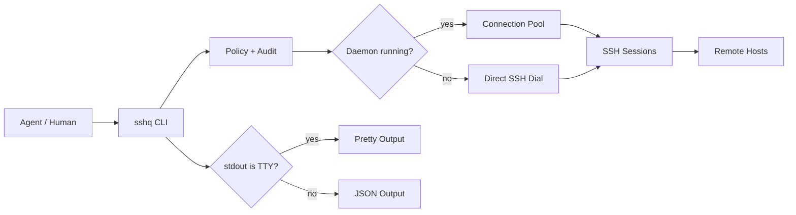

<div align="center">

# sshq

给 Agent 用的 SSH CLI，保留终端手感。

[](https://go.dev)
[](LICENSE)
[]()

[English](README.md) | [中文](README.zh-CN.md)

</div>

AI agent 通常通过子进程调用 SSH。普通 `ssh` 默认假设使用者是人：提示、进度、远端 shell 差异、需要猜测的文本输出，最后都落到调用方身上。

sshq 修的是这层管道。stdout 是管道时默认输出 JSON；stdout 是终端时输出易读文本。远端 stdout 不被 sshq 自己的信息污染。shell 差异在调用方看到结果之前处理掉。

```bash
# 人在终端里执行：stdout 是 TTY，所以输出文本。
sshq web-1 "hostname"
# web-1

# Agent 或脚本调用：stdout 是管道，所以输出 JSON 信封。
sshq web-1 "hostname" | jq .
# {
#   "ok": true,
#   "data": {
#     "exit_code": 0,
#     "stdout": "web-1\n",
#     "stderr": "",
#     "host": "web-1",
#     "duration_ms": 42
#   },
#   "schema_version": 1
# }
```

## 快速开始

### 安装

不需要安装 Go 或其他工具链，选择你的平台：

```bash
# Linux amd64
curl -L https://github.com/shayuc137/sshq/releases/latest/download/sshq_linux_amd64.tar.gz | tar xz
sudo mv sshq /usr/local/bin/

# macOS (Apple Silicon)
curl -L https://github.com/shayuc137/sshq/releases/latest/download/sshq_darwin_arm64.tar.gz | tar xz
sudo mv sshq /usr/local/bin/

# macOS (Intel)
curl -L https://github.com/shayuc137/sshq/releases/latest/download/sshq_darwin_amd64.tar.gz | tar xz
sudo mv sshq /usr/local/bin/
```

Windows：从 [Releases](https://github.com/shayuc137/sshq/releases) 下载 `sshq_windows_amd64.zip`，解压后把 `sshq.exe` 放到 PATH 中的文件夹。

有 Go 1.23+ 的话：`go install github.com/shayuc137/sshq/cmd/sshq@latest`

```bash
sshq version
```

详细的各平台安装步骤见[快速开始指南](docs/zh-CN/guide/getting-started.md)。

### 添加主机

```bash
sshq config add myhost \
  --hostname 10.0.0.1 \
  --user root \
  --identity ~/.ssh/id_ed25519
```

遇到只能用密码登录的设备时，不要把密码写进 `~/.ssh/config`，用加密凭据库保存：

```bash
sshq credential set myhost
```

### 信任主机密钥

```bash
sshq trust myhost
sshq probe myhost
```

`trust` 会把主机密钥写入 `known_hosts`。如果以后密钥变化，sshq 会拒绝覆盖；确认变更可信后再运行 `sshq trust myhost --replace`。

### 执行命令

```bash
sshq myhost "uname -a"
```

上面的快捷写法和下面的显式写法走同一条执行路径：

```bash
sshq exec myhost "uname -a"
```

需要命令专属参数时使用 `exec`：

```bash
sshq exec --script-file ./scripts/health-check.sh myhost
sshq exec --shell powershell win-1 "Get-ComputerInfo | Select-Object CsName,WindowsVersion"
sshq --timeout 10s myhost "hostname"
```

### 传输、批量执行、隧道

```bash
sshq cp ./deploy.tar.gz myhost:/tmp/
sshq cp myhost:/var/log/app.log ./logs/
sshq cp web-1:/data/export.tar.gz backup-1:/srv/backups/

sshq cluster exec "systemctl is-active nginx" --tag web --env production --concurrency 5

sshq tunnel start bastion -L 15432:db.internal:5432
sshq tunnel list
sshq tunnel stop tun-1
```

## sshq 不一样的地方

| 行为 | 为什么重要 |
| --- | --- |
| TTY 自动检测 | Agent 不加 `--json` 也能拿 JSON；人在终端里不加 `--pretty` 也能看易读输出。 |
| `exec` stdout 纯净 | 终端模式下，进程 stdout 精确等于远端 stdout。sshq 的状态、进度和诊断信息走 stderr。 |
| Daemon 连接池 | 重复调用复用 SSH 会话。daemon 不可用时，命令回退到直连 SSH。 |
| SFTP + raw 回退 | 普通服务器走 SFTP；没有 `sftp-server` 的 BusyBox/OpenWrt 这类精简系统走原始字节流。 |
| 远端 shell 探测 | sshq 探测 bash、ash、zsh、sh、PowerShell、cmd，并用匹配的语法包装命令。 |
| 服务器之间中转 | `sshq cp hostA:/path hostB:/path` 通过本地 sshq 进程流式中转，不写本地临时文件。 |
| 能力策略 | 命令黑白名单、路径白名单、隧道转发白名单、临时授权和审计日志在同一层处理。 |
| AI skill 安装 | `sshq skill install` 把 Claude Code 或 Codex 的 SSH 路由切到 sshq。 |

## 输出契约

sshq 按这个顺序决定输出模式：

1. `--json`
2. `--pretty`
3. `SSHQ_OUTPUT=json`
4. stdout 的 TTY 检测结果

对于 `exec`，stdout 是契约：

```bash
# 远端 stdout 保持干净。
sshq myhost "printf 'one\ntwo\n'"
# one
# two

# sshq 诊断信息写入 stderr。
sshq -v myhost "hostname" >/tmp/remote.out 2>/tmp/sshq.log
```

JSON 模式下，同样的保证体现在 `data.stdout`：

```json
{
  "ok": true,
  "data": {
    "exit_code": 0,
    "stdout": "one\ntwo\n",
    "stderr": "",
    "host": "myhost",
    "duration_ms": 42
  },
  "schema_version": 1
}
```

SSH 连接成功不代表远端命令成功。Agent 应同时检查 `ok` 和 `data.exit_code`。

## 安全模型

sshq 把秘密、权限和审计记录放在 `~/.ssh/config` 之外。

### 加密凭据

```bash
sshq credential set router-1
sshq credential list
sshq credential delete router-1
```

密码使用 age 加密。ssh-agent 和私钥认证优先，已保存密码只是最后的回退方式。sshq 没有任何命令会打印已保存的密码。

如果凭据库使用口令模式，并且运行环境没有终端，请在启动 sshq 或 daemon 前设置 `SSHQ_CREDENTIAL_PASSPHRASE`。

### 能力策略

策略写在系统配置目录下的 `config.toml`，Linux 上通常是 `~/.config/sshq/config.toml`。

```toml
[policy.default]
command_whitelist = ["^hostname(\\s|$)", "^uptime(\\s|$)", "^df(\\s|$)"]
command_blacklist = ["(?i)(^|[;&|])\\s*(rm|dd|mkfs|shutdown)\\b"]
local_path_whitelist = ["."]
remote_path_whitelist = ["/tmp", "/var/log"]
local_forward_whitelist = ["localhost:*", "127.0.0.1:*", "db.internal:5432"]
remote_forward_whitelist = ["localhost:3000", "127.0.0.1:8000-9000"]

[policy.hosts.prod-db]
mode = "override"
command_whitelist = ["^journalctl(\\s|$)", "^systemctl\\s+status\\s"]
command_blacklist = ["(?i)\\b(reboot|shutdown|mkfs)\\b"]
remote_path_whitelist = ["/var/log"]
local_forward_whitelist = ["db.internal:5432"]
```

直连 CLI 路径和 daemon 分发路径都会检查策略。对于隧道，本地转发检查远端目标（`remote_host:remote_port`），远端转发检查本地目标（`local_host:local_port`）。

运行前可以先测试策略结果：

```bash
sshq policy validate
sshq policy check prod-db --command "journalctl -u app -n 100"
sshq policy check prod-db --remote-path /var/log/app.log
sshq policy check prod-db --local-forward db.internal:5432
```

临时授权需要终端，按 TTL 过期，并且永远不能覆盖黑名单：

```bash
sshq policy grant prod-db "^journalctl(\\s|$)" --ttl 15m
sshq policy grant prod-db db.internal:5432 --kind local-forward --ttl 15m
sshq policy revoke --alias prod-db
```

### 审计日志

```toml
[audit]
enabled = true
path = "~/.config/sshq/audit.jsonl"
max_size = "10MB"
```

审计记录是 JSONL 元数据，覆盖 `exec`、`cp`、`tunnel`、`cluster` 和被策略拦截的操作。审计不保存命令输出、密码或完整脚本内容。脚本文件操作只记录 SHA-256 哈希和字节数。

```bash
sshq audit --last 50
sshq audit --alias prod-db --operation exec
```

审计开启但日志无法写入时，sshq 会阻止操作，而不是静默绕过审计。

## 架构



Daemon 负责连接池、远端 profile 缓存和后台隧道。没有 daemon 时，CLI 路径仍然可用。

## Agent 集成

sshq 适合被 Claude Code、Codex、Cursor 或自定义 agent 通过普通子进程 API 调用。

```bash
# Agent 通过子进程调用：stdout 是管道，所以输出 JSON。
result=$(sshq myhost "df -h")
# → {"ok":true,"data":{"exit_code":0,"stdout":"...","stderr":"","host":"myhost","duration_ms":42},"schema_version":1}

# 人在终端里输入：stdout 是 TTY，所以输出易读文本。
sshq myhost "df -h"
# → Filesystem      Size  Used Avail Use% Mounted on
#   /dev/sda1        50G   12G   35G  26% /
```

安装内置 skill：

```bash
sshq skill install                       # Claude Code，用户级
sshq skill install --codex               # Codex
sshq skill install --project             # 项目级安装
sshq skill status
```

这个 skill 会把 SSH 操作路由到 sshq，按场景加载命令参考，并避免 agent 直接使用原始 `ssh` / `scp`。

## 文档

| 资源 | 适用场景 |
| --- | --- |
| [快速开始](docs/zh-CN/guide/getting-started.md) | 安装 sshq、添加主机、信任密钥、运行第一条命令 |
| [远程执行](docs/zh-CN/guide/remote-execution.md) | 命令执行、脚本文件、shell 覆盖、超时、Windows 编码 |
| [文件传输](docs/zh-CN/guide/file-transfer.md) | 上传、下载、递归复制、远端到远端中转、传输引擎回退 |
| [集群操作](docs/zh-CN/guide/cluster-operations.md) | 对筛选出的多台主机执行同一条命令并控制并发 |
| [SSH 隧道](docs/zh-CN/guide/tunnels.md) | 创建本地/远端端口转发，管理 daemon 持有的隧道 |
| [主机管理](docs/zh-CN/guide/host-management.md) | 编辑 SSH config、元数据、ProxyJump 链、凭据、主机密钥 |
| [安全](docs/zh-CN/guide/security.md) | 配置凭据加密、能力策略、临时授权、审计日志 |
| [Agent 集成](docs/zh-CN/guide/agent-integration.md) | 理解 JSON 信封、stdout 纯净性、错误处理和 skill 用法 |
| [Skill 包](skills/sshq/SKILL.md) | 查看 agent 使用的路由表 |
| [Skill 参考](skills/sshq/references/) | 查看按场景拆分的命令参考 |

## 项目结构

```text
sshq/
├── cmd/sshq/              # 入口
├── internal/
│   ├── audit/             # JSONL 操作审计日志
│   ├── cli/               # Cobra 命令定义
│   ├── config/            # SSH 配置解析 + sshq 元数据
│   ├── credential/        # 加密密码凭据库
│   ├── exec/              # 远程命令执行
│   ├── output/            # TTY 检测，JSON/易读渲染
│   ├── policy/            # 能力策略、临时授权、转发/路径检查
│   ├── pool/              # 连接池 daemon
│   ├── remote/            # shell 探测、编码、profile 缓存
│   ├── sshclient/         # SSH 连接、ProxyJump、主机密钥处理
│   ├── transfer/          # SFTP + 原始字节流文件传输
│   └── tunnel/            # SSH 隧道管理
├── skills/sshq/           # AI skill 包
└── docs/                  # 指南和命令参考
```

## 参与贡献

开发环境、工作流、测试、文档同步和提交信息规则见 [CONTRIBUTING.md](CONTRIBUTING.md)。

## 许可证

[MIT](LICENSE)
