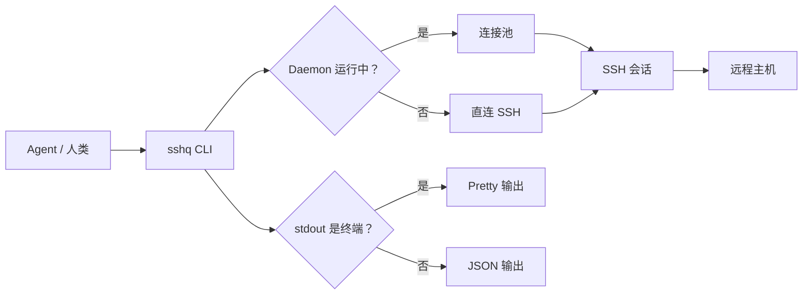

<div align="center">

# sshq

**为 AI Agent 打造的 SSH 多路复用 CLI。**

单二进制。跨平台。Agent 零配置获得结构化输出。

[](https://go.dev)
[](LICENSE)
[]()

[English](README.md) | [中文](README.zh-CN.md)

</div>

---

## 这是什么？

sshq 是一个专为 AI Agent 设计的 SSH 命令行工具。当 Agent 通过子进程调用 sshq 时，自动输出结构化 JSON——不需要加 `--json`。当人类在终端中使用时，自动显示格式化表格。这由 [TTY 检测](docs/guide/agent-integration.md)决定，无需任何配置。

底层实现：daemon 连接池跨调用复用 SSH 会话；SFTP 不可用时自动降级为原始字节流传输；远程 shell 类型自动探测（bash、ash、powershell、cmd），命令包装无需调用方关心。

## 快速开始

**安装：**

```bash
go install github.com/shayuc137/sshq/cmd/sshq@latest
```

也可以从 [GitHub Releases](https://github.com/shayuc137/sshq/releases) 下载预编译二进制。

**添加主机：**

```bash
sshq config add myhost --hostname 10.0.0.1 --user root --identity ~/.ssh/id_ed25519
```

**执行命令：**

```bash
sshq myhost "uname -a"
```

**传输文件：**

```bash
sshq cp ./deploy.tar.gz myhost:/tmp/
```

**集群执行：**

```bash
sshq cluster exec --tag web "systemctl status nginx"
```

## 核心能力

| 能力 | 说明 |
|------|------|
| **TTY 自动检测** | 管道输出 JSON，终端输出 pretty。Agent 零 flag 获得结构化数据。 |
| **连接池** | Daemon 复用 SSH 会话，自动启动，透明降级。 |
| **Shell 探测** | 自动识别远程 shell（bash/ash/powershell/cmd），正确包装命令。 |
| **传输引擎** | 优先 SFTP，不可用时自动降级为原始字节流。 |
| **跨服务器中转** | `sshq cp host-a:/data host-b:/backup`——直接中转，无需本地暂存。 |
| **ProxyJump 链** | SSH config 中的多级跳板自动解析，直接使用目标别名。 |
| **集群并发** | 按 tag、env 或主机列表过滤，多主机并发执行。 |
| **SSH 隧道** | 本地和远程端口转发，自动重连。 |

## 架构



## Agent 集成

sshq 为 AI Agent（Claude Code、Cursor、Codex 等）设计。核心原则：**Agent 不需要特殊 flag**。

```bash
# Agent 通过子进程调用——stdout 是管道，自动输出 JSON：
result=$(sshq myhost "df -h")
# → {"ok":true,"data":{"exit_code":0,"stdout":"...","stderr":"","host":"myhost","duration_ms":42},"schema_version":1}

# 人类在终端中执行——stdout 是 TTY，自动输出 pretty：
sshq myhost "df -h"
# → Filesystem      Size  Used Avail Use% Mounted on
#   /dev/sda1        50G   12G   35G  26% /
```

**作为 Claude Code Skill 安装：**

```bash
claude skill add --from github.com/shayuc137/sshq/skills/sshq
```

详见 [Agent 集成指南](docs/guide/agent-integration.md)，了解输出协议、错误处理和 stdout 纯净性保证。

## 输出模式

| 模式 | 触发条件 | 覆盖方式 |
|------|----------|----------|
| **JSON** | stdout 是管道（Agent） | `--json` 在终端中强制 JSON |
| **Pretty** | stdout 是终端（人类） | `--pretty` 在管道中强制 pretty |

sshq 的所有信息性消息（连接状态、传输进度、耗时统计）只走 stderr。exec 命令的 stdout 始终是远程命令 stdout 的精确镜像——任何模式下都不会被污染。

环境变量：`SSHQ_OUTPUT=json` 全局强制 JSON 输出。

## 文档

| 资源 | 说明 |
|------|------|
| [快速开始](docs/guide/getting-started.md) | 安装、配置第一台主机、执行第一条命令 |
| [远程执行](docs/guide/remote-execution.md) | exec、脚本文件、shell 覆盖、超时、编码处理 |
| [文件传输](docs/guide/file-transfer.md) | 上传、下载、中转、递归、引擎降级 |
| [集群操作](docs/guide/cluster-operations.md) | 多主机并发、tag/env/hosts 过滤 |
| [SSH 隧道](docs/guide/tunnels.md) | 本地/远程转发、多隧道管理 |
| [主机管理](docs/guide/host-management.md) | 配置增删改、元数据、ProxyJump、信任 |
| [Agent 集成](docs/guide/agent-integration.md) | TTY 检测、JSON 协议、stdout 纯净性、Skill 安装 |
| [命令参考](docs/commands/reference.md) | 所有命令、flag 和默认值 |

## 项目结构

```
sshq/
├── cmd/sshq/              # 入口
├── internal/
│   ├── cli/               # Cobra 命令定义
│   ├── config/            # SSH 配置解析 + 元数据
│   ├── exec/              # 远程命令执行
│   ├── output/            # 输出层（TTY 检测、JSON/Pretty）
│   ├── pool/              # 连接池（Daemon）
│   ├── remote/            # Shell 探测、编码、Profile 缓存
│   ├── sshclient/         # SSH 连接 + ProxyJump + Host Key
│   ├── transfer/          # SFTP + 原始字节流文件传输
│   └── tunnel/            # SSH 隧道管理
├── skills/sshq/           # Claude Code Skill 包
└── docs/                  # 使用指南与命令参考
```

## 参与贡献

欢迎贡献。详见 [CONTRIBUTING.md](CONTRIBUTING.md) 了解开发环境搭建和贡献规范。

<a href="https://github.com/shayuc137/sshq/graphs/contributors">
  
</a>

## 许可证

[MIT](LICENSE)
